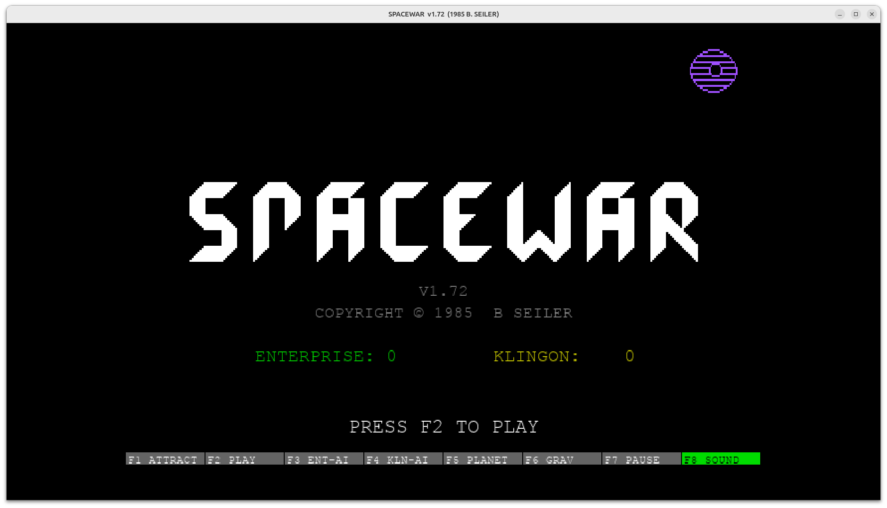
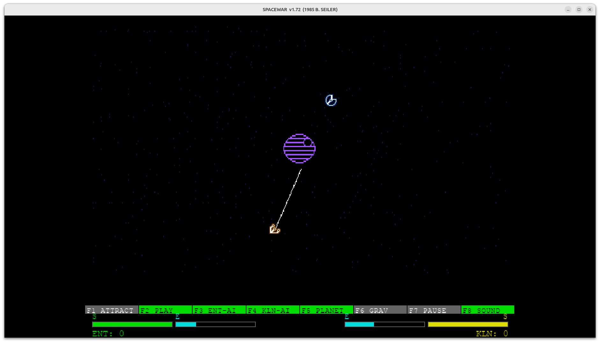
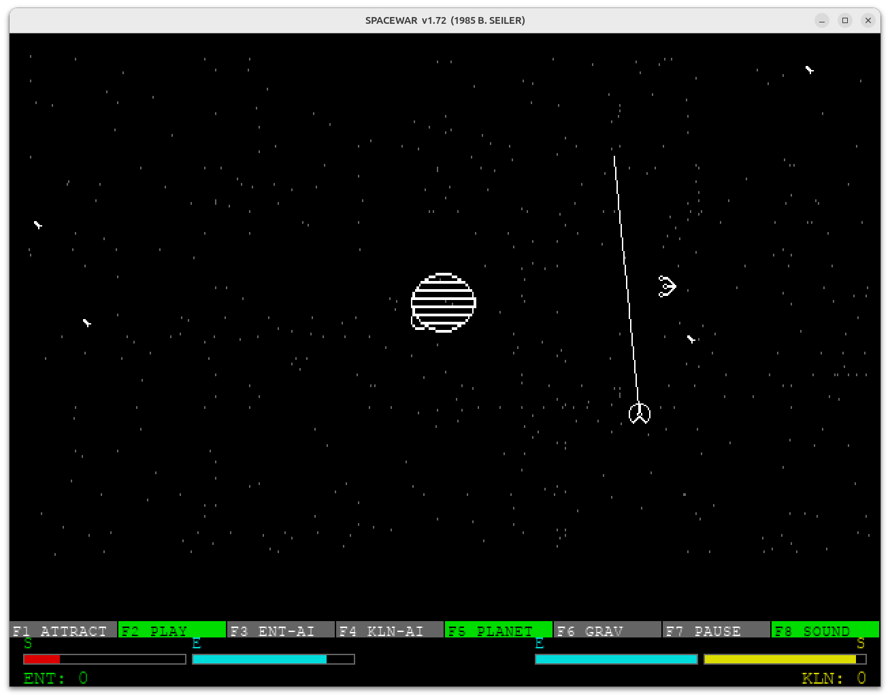
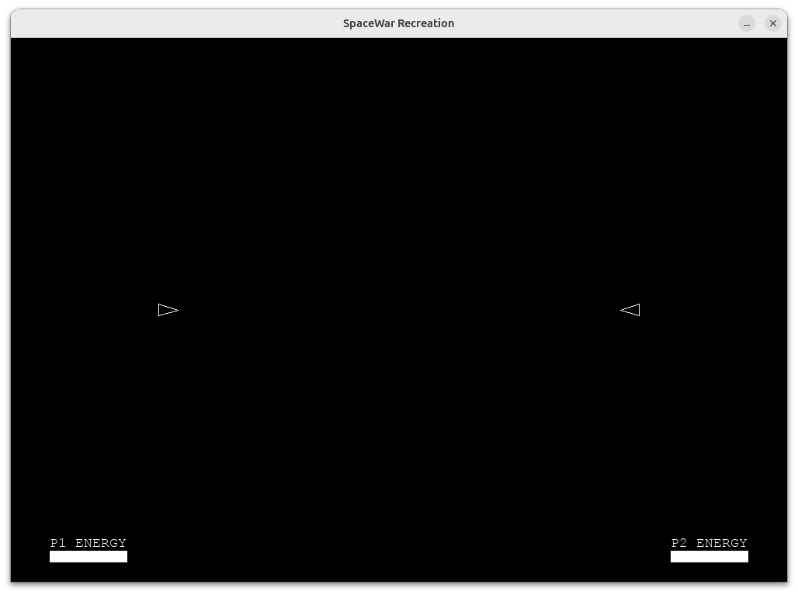
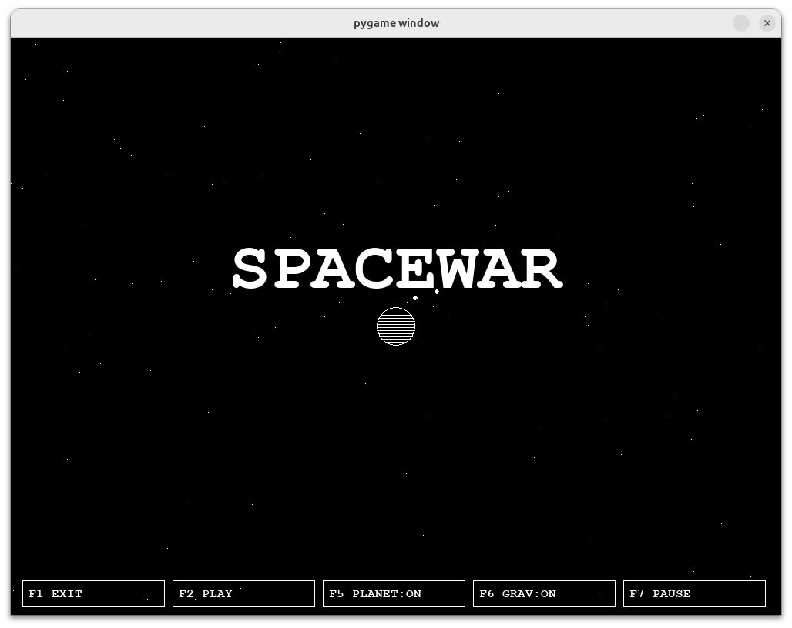
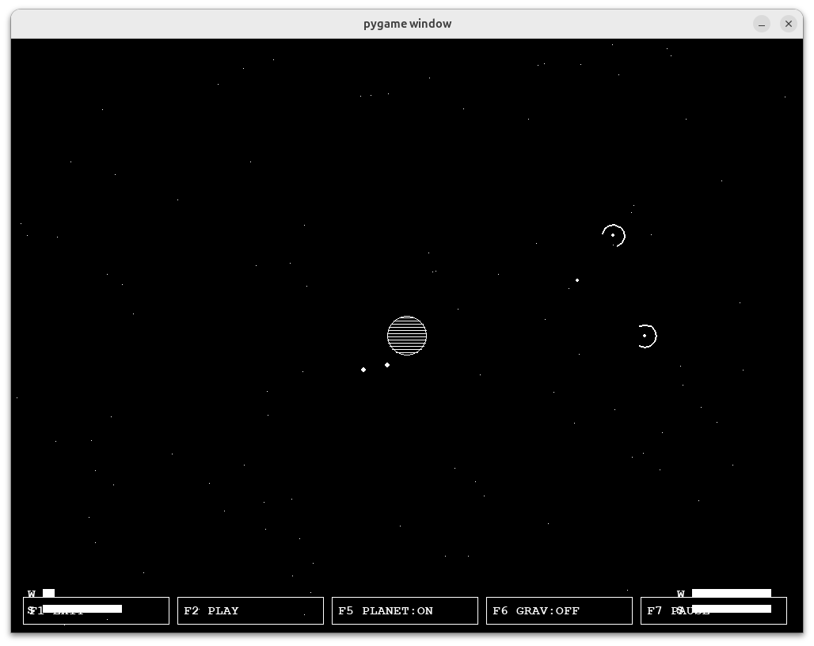
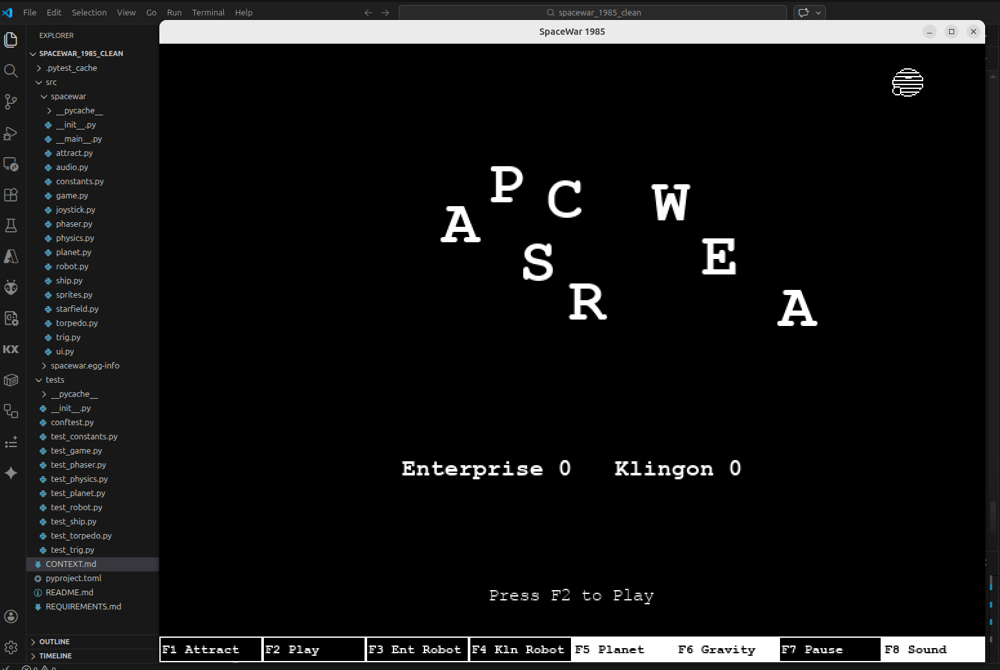
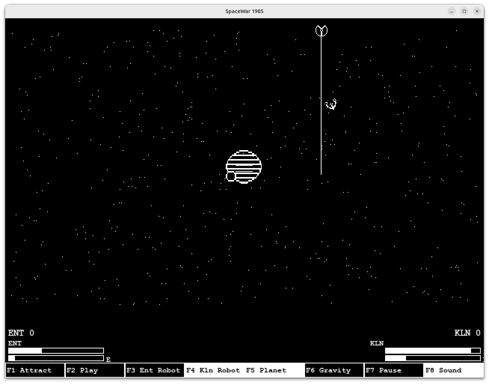

# SpaceWar 1985








A faithful Python/Pygame recreation of Bill Seiler's **SpaceWar v1.72** (1985, DOS/CGA).

Two ships battle in space near a gravitational planet. Physics, weapon mechanics, and game logic are ported 1:1 from the original x86 Assembly source (v1.50).


## How it's made

I've always loved the 1985 version since playing it on a my uncle's 8088 PC (on 5" floppy).
I've looked at rebuilding the game in java and python over the years, and always get so far and never finished.

I initially asked gemini a couple of questions about the game and gave it the orginial manual to read and build the game from.
Over a coupe of prompts we got something playable and then added some of the features. THis was quickly over ~ 30 mins.







The Gemini experiment was enough to convince me to try this in earnest
This was built over the course of a week using Claude as an experiment to see how easy AI could be used to reverse engineer something.
Total time wise was probably < 16 hrs, so around 2 days work, but I regular maxed out claude sessions so left it and came back later.
It was amazing to see what AI programming can do.

There are 3 branches to this repository.

### main 

Initial version recreated with access to the original Assembly code, and screenshots + some basic requirements.
The orginial this was shareware released, and the code is readily accessible, but not included. In this branch you will see references to original modules in the code where the AI has tried to recreate.

### clean

In this branch i've removed all reference to the source code and other materials used

### recreate_from_requirements_docs. 

In this branch i made a trial of using the requirements, readme and context markdown files as the only source of information and asked claude to recreate the game. What's committed is what came out of a single pass after this prompt
  "Based on the 3 docs attached, can you please recreate the Spacewar 1985 Game that I enjoyed as a child.
   You should use python and pygame, it should be in a module called spacewar and there should be ample test coverage using pytest."

While the game itself has a lot of bugs, the asthetics are very close and some things like the energy bars are actually closer to the original then the main version





---


## Software Requirements

- Python 3.11+
- pygame 2.5+

```
pip install -e ".[dev]"
```

## Running

```
spacewar
```

or

```
python -m spacewar
```

### Command-line options

| Flag | Effect |
|:---|:---|
| `--scale N` | Scale the window by N (e.g. `--scale 2` = 1280×960) |
| `--2x` | Alias for `--scale 2` |
| `--scale 3` | 3× window **and** enables neon colour mode (easter egg) |
| `--neon` | Neon colour mode — white-hot sprites with coloured glow halos |
| `--altkeys` | Replace Klingon numpad layout with UIO / JKL / M,. keys |

The window is also freely resizable at runtime; the game letterboxes to maintain the correct aspect ratio.

## Controls

### Keyboard

| Action | Enterprise (P1) | Klingon (P2) | Klingon `--altkeys` |
|:---|:---|:---|:---|
| Fire Phasers | Q | KP7 | U |
| Fire Torpedo | E | KP9 | O |
| Cloak | W | KP8 | I |
| Rotate Left | A | KP4 | J |
| Thrust | S | KP5 | K |
| Rotate Right | D | KP6 | L |
| Shields → Energy | Z | KP1 | M |
| Hyperspace | X | KP2 | , |
| Energy → Shields | C | KP3 | . |

**Function keys:** F1 Attract · F2 Play · F3 Enterprise Robot · F4 Klingon Robot · F5 Planet · F6 Gravity · F7 Pause · F8 Sound

### Gamepad (Xbox-style controller)

Up to two controllers are supported — Player 1 on joystick 0 (Enterprise), Player 2 on joystick 1 (Klingon). Both controllers use the same button layout.

| Input | Action |
|:---|:---|
| Left stick X | Rotate left / right |
| Left trigger | Thrust |
| **A** button | Fire phasers |
| **B** button | Cloak |
| **X** button | Fire photon torpedo |
| **Y** button | Hyperspace |
| LB | Hyperspace (alternate) |
| RB | Fire photon torpedo (alternate) |
| Right trigger | Fire phasers (alternate) |
| Right stick ← | Shields → Energy |
| Right stick → | Energy → Shields |
| D-Pad Up | Toggle planet |
| D-Pad Down | Toggle sound |
| Select | Attract / exit |
| Start *(attract screen)* | Start game |
| Start *(in-game)* | Pause |
| Right stick click | Toggle own robot AI |

> **Note:** Axis and button indices are verified against a specific controller.
> If your gamepad uses a different SDL2 mapping, adjust the constants at the
> top of `src/spacewar/joystick.py`.

## Tests

```
pytest
```

---

## Similar Projects

- Another pygame recreation in progress — <https://github.com/e-dong/space-war-rl>
- old pygame impl - https://github.com/alfredgg/spacewar
- PDP version from 1972 — <https://github.com/MattisLind/SPACEWAR>
- Other PDP sources — <https://www.masswerk.at/spacewar/sources/>
