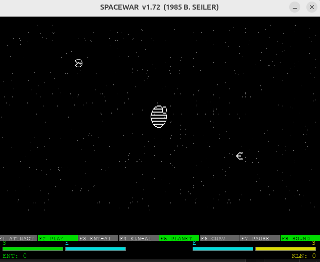

# SpaceWar 1985




A faithful Python/Pygame recreation of Bill Seiler's **SpaceWar v1.72** (1985, DOS/CGA).

Two ships battle in space near a gravitational planet. Physics, weapon mechanics, and game logic are ported 1:1 from the original x86 Assembly source (v1.50).


---

## Requirements

- Python 3.11+
- pygame 2.5+

```
pip install -e ".[dev]"
```

## Running

```
spacewar
```

or

```
python -m spacewar
```

## Controls

| Action | Enterprise (P1) | Klingon (P2) |
|:---|:---|:---|
| Fire Phasers | Q | KP7 |
| Fire Torpedo | E | KP9 |
| Cloak | W | KP8 |
| Rotate Left | A | KP4 |
| Thrust | S | KP5 |
| Rotate Right | D | KP6 |
| Shields → Energy | Z | KP1 |
| Hyperspace | X | KP2 |
| Energy → Shields | C | KP3 |

**Function keys:** F1 Attract · F2 Play · F3 Enterprise Robot · F4 Klingon Robot · F5 Planet · F6 Gravity · F7 Pause · F8 Sound

## Tests

```
pytest
```

---

## Similar Projects

- Another pygame recreation in progress — <https://github.com/e-dong/space-war-rl>
- PDP version from 1972 — <https://github.com/MattisLind/SPACEWAR>
- Other PDP sources — <https://www.masswerk.at/spacewar/sources/>
